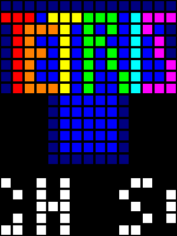
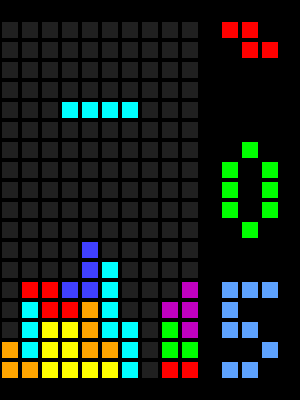
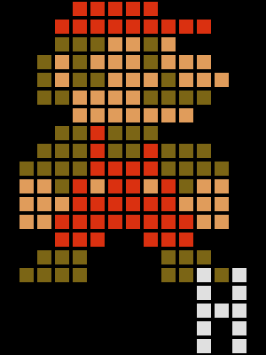
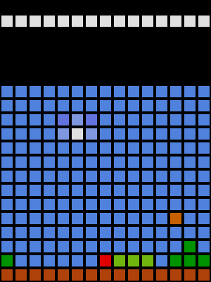
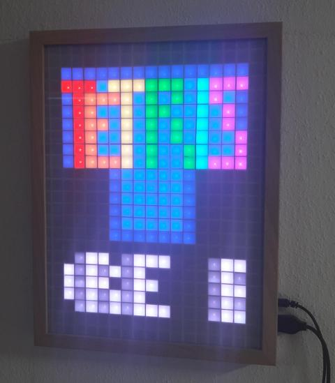
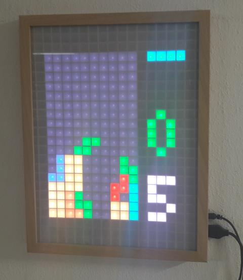

# Make:Block reloaded

This repository contains the source code for the updated Make:Block
project as published in [Make 04/2016](http://www.heise.de/make/inhalt/2016/4/52/).

The `orig` subdirectory contains a Linux environment to run the original
sketch publsihed in [Make 01/2015](http://www.heise.de/make/inhalt/2015/1/12/)
directly on a Linux PC. This setup simplifies development and is the 
foundation of a totally rewritten game engine.

 

The latest version includes a second game featuring a red dot
inspired by an italian plumber. The game can be selected in
the main title screen.

 

## Hardware

The final hardware cosist of an Arduino Nano and 300 WS2812B
LED arranged in a 20*15 grid. The LEDs are to be connected
to arduino port D12, the left button to port D5, the right button
to port D6, the drop (up) button to port D7, the down button to
port D8 and the rotate (fire) button to port D11. A speaker may
be connected to port D9.

Holding a key during power-up will bring up a config menu. Moving
left/right during gameplay while holding down the fire button
pauses the game.

 

## Compilation

### For Arduino

Download the whole repository to your local PC. Make sure the local
directory is named ```make-block-reloaded```.

Open the file ```make-block-reloaded.ino``` in the Arduino IDE. Then
install the latest FastLED library e.g. from within the IDE's menu
under "sketch->install libraries". The FastLED lib is found in the
"display" section.

Now simply hit the build button.

### For Linux PC

This sketch can run natively on a Linux PC (that's what has been
used to create the screenshots above).

Simple enter  ```make``` to build the Linux version. You might need
to install libsdl. They keys are mapped to right shift and the cursor
keys.

